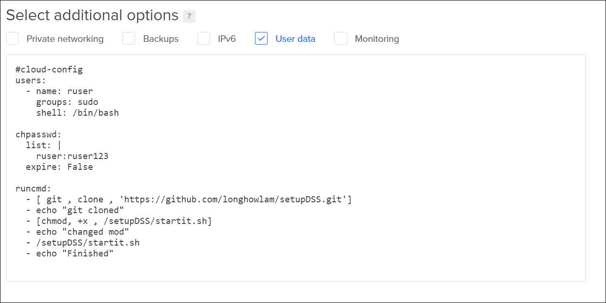

# setupDSS
setup an R/RStudio and dataiku DSS environment on a digital ocean droplet. Copy the content of droplet_data.sh and paste it into the user data field when setting up your droplet.

During the creation of the droplet it will clone the startit.sh script from this repository and execute it. Installing R/RStudio, Dataiku and creating a user ruser with password ruser123

